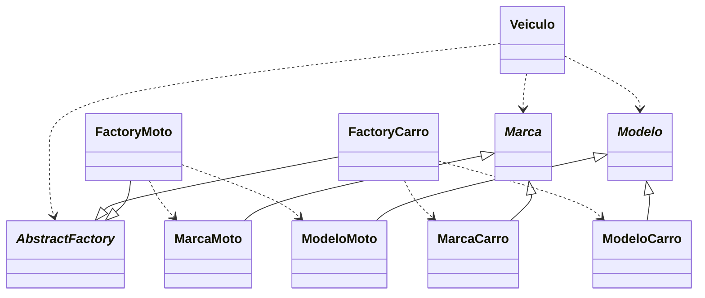

### 🚀 Diagrama do Codigo de Exemplo

```mermaid
classDiagram
  FactoryMoto --|> _AbstractFactory_
  FactoryCarro --|> _AbstractFactory_

  Veiculo ..> _AbstractFactory_
  Veiculo ..> _Marca_
  Veiculo ..> _Modelo_

  _Marca_ <|-- MarcaMoto
  _Marca_ <|-- MarcaCarro

  _Modelo_ <|-- ModeloMoto
  _Modelo_ <|-- ModeloCarro

  FactoryMoto ..> MarcaMoto
  FactoryMoto ..> ModeloMoto

  FactoryCarro ..> MarcaCarro
  FactoryCarro ..> ModeloCarro
```
