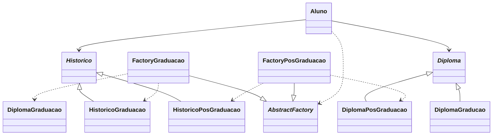
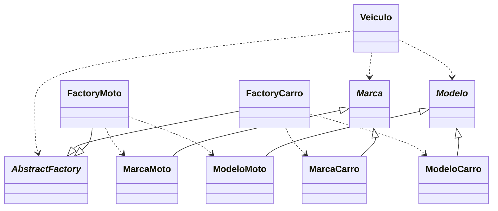

# 📚 Abstract-Factory

O padrão Abstract Factory é um padrão de projeto criacional que fornece uma interface para criar famílias de objetos relacionados ou dependentes sem especificar suas classes concretas.

### 🏗️ Estrutura do Padrão

### 🔍 Explicação
Este diagrama ilustra a aplicação do padrão Abstract Factory em um sistema acadêmico que produz documentos (diplomas e históricos) para diferentes níveis de formação (graduação e pós-graduação).

**Componentes principais:**
- `_AbstractFactory_`: Interface que define métodos para criar documentos acadêmicos
- `FactoryGraduacao` e `FactoryPosGraduacao`: Implementações concretas que criam documentos específicos para cada nível
- `_Diploma_` e `_Historico_`: Interfaces para os produtos (documentos)
- Implementações concretas dos produtos: `DiplomaGraduacao`, `DiplomaPosGraduacao`, etc.
- `Aluno`: Cliente que utiliza as fábricas para obter documentos

**Funcionamento:**
- O `Aluno` solicita documentos à `_AbstractFactory_`
- Dependendo da fábrica concreta usada (`FactoryGraduacao` ou `FactoryPosGraduacao`), são retornados documentos específicos para cada nível.
- O cliente não precisa conhecer as implementações concretas dos documentos

### 🌟 Por que usar o Abstract Factory?
**Este padrão é particularmente útil quando:**
- Seu sistema precisa ser independente de como seus produtos são criados
- Você precisa trabalhar com múltiplas famílias de produtos relacionados
- Você quer garantir que os produtos criados sejam compatíveis entre si

### 🏆 Vantagens
✅Isolamento de classes concretas  
✅Troca fácil de famílias de produtos  
✅Promove a consistência entre produtos  
✅Aderência ao Princípio de Responsabilidade Única  
✅Aderência ao Princípio Aberto/Fechado

### ⚠️ Desvantagens
❌ Pode se tornar complexo com muitas famílias de produtos  
❌ Difícil de estender para novos tipos de produtos

### 💡 Aplicações Práticas
- Sistemas de UI multiplataforma
- Acesso a dados com diferentes bancos de dados
- Sistemas de plugins ou temas
- Jogos com diferentes estilos de personagens/cenários

### 🚀 Diagrama do Codigo de Exemplo

