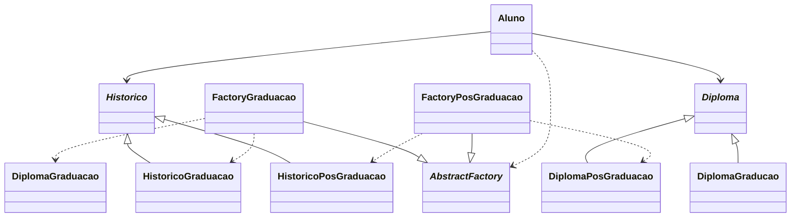
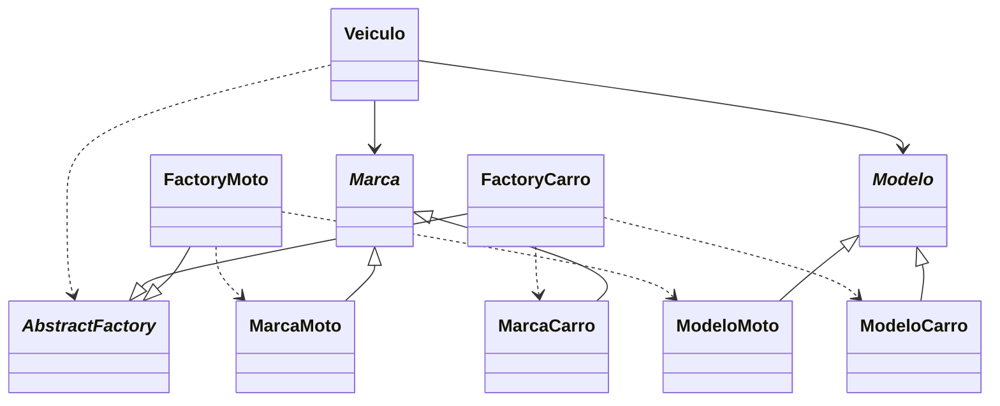

# Abstract-Factory

```mermaid
classDiagram
  FactoryGraduacao --|> _AbstractFactory_
  FactoryPosGraduacao --|> _AbstractFactory_
  Aluno ..> _AbstractFactory_
  Aluno --> _Diploma_
  Aluno --> _Historico_
  _Diploma_ <|-- DiplomaGraducao
  _Diploma_ <|-- DiplomaPosGraduacao
  _Historico_ <|-- HistoricoGraduacao
  _Historico_ <|-- HistoricoPosGraduacao
  FactoryGraduacao ..> DiplomaGraduacao
  FactoryGraduacao ..> HistoricoGraduacao
  FactoryPosGraduacao ..> DiplomaPosGraduacao
  FactoryPosGraduacao ..> HistoricoPosGraduacao
```

### Explicação
-

### Diagrama do Codigo de Exemplo

```mermaid
classDiagram
  FactoryMoto --|> _AbstractFactory_
  FactoryCarro --|> _AbstractFactory_
  Veiculo ..> _AbstractFactory_
  Veiculo --> _Marca_
  Veiculo --> _Modelo_
  _Marca_ <|-- MarcaCarro
  _Marca_ <|-- MarcaMoto
  _Modelo_ <|-- ModeloCarro
  _Modelo_ <|-- ModeloMoto
  FactoryMoto ..> ModeloMoto
  FactoryMoto ..> MarcaMoto
  FactoryCarro ..> MarcaCarro
  FactoryCarro ..> ModeloCarro
```
